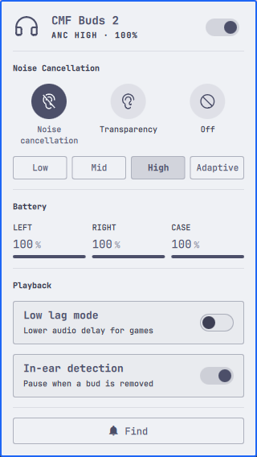

# Nothing Buds

ANC, battery and playback controls for Nothing and CMF earbuds, as an Omarchy
bar widget.

<p>
  
  
</p>

The panel follows your Omarchy theme; both shots are the same build.

- A dot on the bar icon carries the mode. Filled for ANC, hollow for
  transparency, drained when off or disconnected.
- Noise control: off, transparency, and ANC at low, mid, high or adaptive.
- Per-bud and case battery. The meter turns urgent below 20% and pulses while
  charging.
- Low lag mode and in-ear detection.
- Connect and disconnect the buds from the panel header.
- Find my buds. The tone stops itself after 8 seconds.

Developed against CMF Buds 2 (B179). Other Nothing and CMF models speak the
same protocol, but I have only tested that one. If the panel never connects,
check the [RFCOMM channel](#rfcomm-channel) first.

## Requirements

| | |
|---|---|
| [earctl](https://github.com/DaanHessen/earctl) | Speaks the Nothing RFCOMM protocol. AGPL-3.0. This plugin calls it as a separate program over its local HTTP API and does not bundle it. The source-build path is pinned to the exact commit behind v0.1.2 |
| `bluez-utils` | `bluetoothctl`, for link state and connect/disconnect |
| `jq` | The wrapper builds its JSON output with it |

## Install

```sh
omarchy plugin add https://github.com/SaiAungMinKhant/omarchy-nothing-buds.git --enable
```

That is the whole thing. On first load the plugin installs what it needs:
the `earbuds` wrapper into `~/.local/bin` and a systemd user service that
keeps the RFCOMM session open. Both are a file copy and a `--user` unit, so
neither asks for a password and neither needs a terminal.

The one exception is `earctl`. Installing it from the AUR can ask for a
password, and there is nowhere to type one into a bar panel, so if it is
missing the panel offers an "Install earctl" button that opens a terminal.
The panel then notices on its own when it appears.

You can also run the installer directly if you prefer:

```sh
~/.config/omarchy/plugins/io.github.saiaungminkhant.nothing-buds/setup/install.sh
```

Run by hand it installs earctl too, since it has a terminal to work with.

## Uninstall

```sh
~/.config/omarchy/plugins/io.github.saiaungminkhant.nothing-buds/setup/uninstall.sh
omarchy plugin remove io.github.saiaungminkhant.nothing-buds
```

Run them in that order. `omarchy plugin remove` deletes the plugin folder and
nothing else, and the uninstall script lives inside it.

The script stops and removes the systemd service, deletes the `earbuds`
wrapper and `~/.config/earbuds`, and removes `earctl`. It removes earctl the
way it was installed: through the package manager if a package owns it,
otherwise by deleting the binary. Pass `--keep-earctl` if something else on
your system uses it.

## Configuration

The wrapper resolves your earbuds' address in this order: `EARBUDS_ADDR`,
then `~/.config/earbuds/address`, then the first paired device whose name
looks like a Nothing or CMF product. `install.sh` writes the config file for
you.

To pin it per-widget instead, add keys to this widget's entry in
`~/.config/omarchy/shell.json`:

```json
{ "id": "io.github.saiaungminkhant.nothing-buds", "address": "AA:BB:CC:DD:EE:FF", "channel": 16 }
```

### RFCOMM channel

earctl finds the channel with `sdptool`. Arch no longer ships it, and it now
lives in AUR `bluez-utils-compat`, so the wrapper pins 16 instead. That is the
right channel for CMF Buds 2.

Other models differ. Probe for the channel that *answers*, not the ones that
merely accept a connection:

```sh
for ch in $(seq 1 30); do
  earctl disconnect >/dev/null 2>&1
  earctl auto-connect --bluetooth-address "$ADDR" --channel "$ch" >/dev/null 2>&1 \
    && earctl battery >/dev/null 2>&1 && echo "channel $ch works"
done
```

On my buds five channels opened and four of them went quiet. Only one returned
a battery reading.

## What is not here

None of these are hardware limits. The Nothing X app drives all four on the
same earbuds. They are gaps in earctl.

| | |
|---|---|
| Equalizer | `eq set` returns ok and the device ignores it. It always reads back mode 0 |
| Ultra bass | Rejected as unsupported. `earctl detect` returns `model_id: null` because B179 is missing from its model table |
| Spatial audio | No protocol opcode in earctl at all |
| Gestures | Readable over `/api/gestures` as raw numeric codes, with no name mapping |

## Notes

Only one program can hold the Nothing RFCOMM socket at a time. BudsLink,
ear-web and this plugin will fight over it. Stop the service before you run
another one:

```sh
systemctl --user stop earctl.service
```

## Licenses

MIT. See [LICENSE](LICENSE).

The bundled [Phosphor Icons](https://phosphoricons.com) path data is also MIT.
Its notice is in [licenses/phosphor-LICENSE](licenses/phosphor-LICENSE).

Not affiliated with, endorsed by, or connected to Nothing Technology Limited.
"Nothing", "CMF" and the product names are their trademarks, used here only to
say what this controls.
