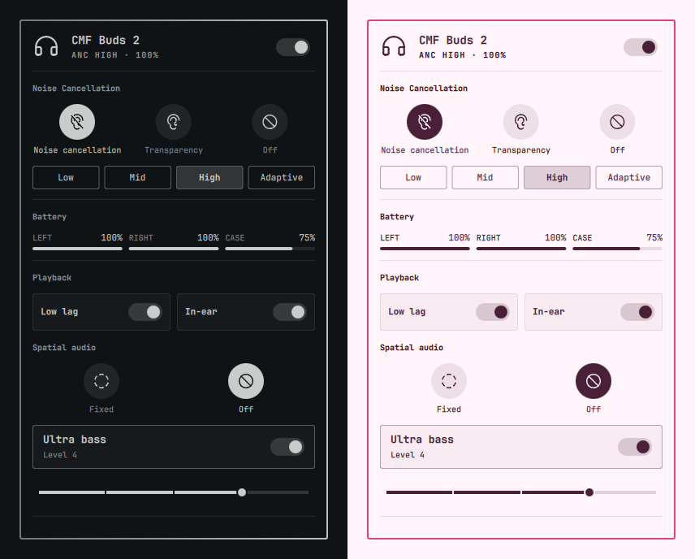

# Nothing Buds

ANC, battery and playback controls for Nothing and CMF earbuds, as an Omarchy
bar widget.



- Bar pill showing the mode at a glance: a filled dot for ANC, a hollow ring
  for transparency, drained when off or disconnected.
- Noise control — off, transparency, and ANC at low / mid / high / adaptive.
- Per-bud and case battery, with a meter that turns urgent below 20% and
  pulses while charging.
- Low lag mode and in-ear detection.
- Connect and disconnect the buds from the panel header.
- Find my buds, bounded to 8 seconds so the tone cannot be left ringing.

Developed against **CMF Buds 2 (B179)**. Other Nothing and CMF models speak the
same protocol and should work, but only that one has been tested — see
[RFCOMM channel](#rfcomm-channel) if the panel never connects.

## Requirements

| | |
|---|---|
| [earctl](https://github.com/DaanHessen/earctl) | Talks the Nothing RFCOMM protocol. **AGPL-3.0**, used as a separate program over its local HTTP API — it is not bundled here |
| `bluez-utils` | `bluetoothctl`, for link state and connect/disconnect |
| `jq` | The wrapper composes its JSON with it |

## Install

```sh
omarchy plugin add https://github.com/SaiAungMinKhant/omarchy-nothing-buds.git --enable
~/.config/omarchy/plugins/io.github.saiaungminkhant.nothing-buds/setup/install.sh
```

Omarchy plugins are QML only — there is no dependency declaration or
post-install hook — so the second step is run by hand once. It installs
`earctl`, the `earbuds` wrapper into `~/.local/bin`, and a systemd user
service that holds the RFCOMM session open. Until it has run, the panel says
so instead of failing silently.

## Configuration

The wrapper resolves your earbuds' address from, in order: `EARBUDS_ADDR`,
`~/.config/earbuds/address`, then the first paired device whose name looks
like a Nothing or CMF product. `install.sh` writes the config file for you.

To pin it per-widget instead, add keys to this widget's entry in
`~/.config/omarchy/shell.json`:

```json
{ "id": "io.github.saiaungminkhant.nothing-buds", "address": "AA:BB:CC:DD:EE:FF", "channel": 16 }
```

### RFCOMM channel

earctl discovers the channel with `sdptool`, which Arch no longer ships (it
lives in AUR `bluez-utils-compat`), so the wrapper pins **16** — correct for
CMF Buds 2. If your model differs, find yours by probing for the channel that
answers rather than merely accepts a connection:

```sh
for ch in $(seq 1 30); do
  earctl disconnect >/dev/null 2>&1
  earctl auto-connect --bluetooth-address "$ADDR" --channel "$ch" >/dev/null 2>&1 \
    && earctl battery >/dev/null 2>&1 && echo "channel $ch works"
done
```

Several channels will open and then time out; only one returns battery.

## What is not here

These are limits of earctl against this model, not of the hardware — the
Nothing X app drives all of them:

| | |
|---|---|
| Equalizer | `eq set` returns ok but the device ignores it; it always reads back mode 0 |
| Ultra bass | Rejected as unsupported because `earctl detect` returns `model_id: null` — B179 is not in earctl's model table |
| Spatial audio | No protocol opcode in earctl at all |
| Gestures | Readable over `/api/gestures` as raw numeric codes, with no name mapping |

## Notes

Only one program may hold the Nothing RFCOMM socket at a time. BudsLink,
ear-web and this plugin will fight each other; stop the service first with
`systemctl --user stop earctl.service`.

## Licences

MIT — see [LICENSE](LICENSE).

Bundled [Phosphor Icons](https://phosphoricons.com) path data is MIT; its
notice is in [licenses/phosphor-LICENSE](licenses/phosphor-LICENSE).

Not affiliated with, endorsed by, or connected to Nothing Technology Limited.
"Nothing", "CMF" and product names are their trademarks, used here only to say
what this controls.
